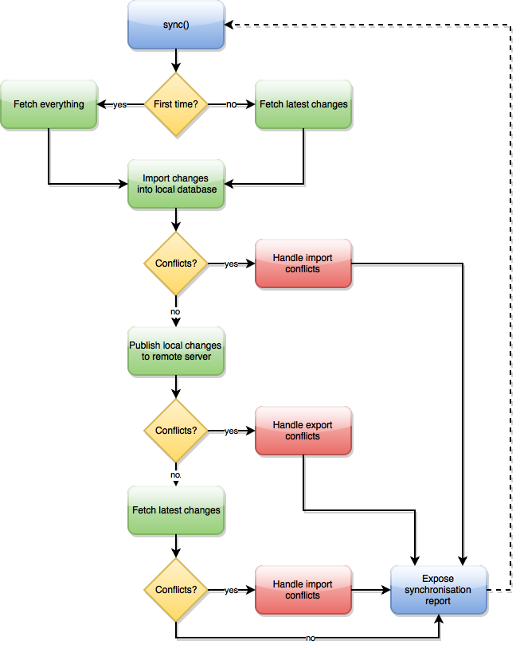

# API documentation

The detailed API documentation is available [here](https://doc.esdoc.org/github.com/Kinto/kinto.js/). This page provides an abstract of it, aimed at making you immediately productive.

## The `Kinto` constructor

```js
const db = new Kinto(options);
```

`options` is an object defining the following option values:

- `remote`: The remote Kinto server endpoint root URL (eg. `"https://server/v1"`). Not that you *must* define a URL matching the version of the protocol the client supports, otherwise you'll get an error;
- `headers`: The default headers to pass for every HTTP request performed to the Kinto server (eg. `{"Authorization": "Basic bWF0Og=="}`);
- `adapter`: The persistence layer adapter to use for saving data locally (default: `Kinto.adapters.IDB`); alternatively, a `Kinto.adapters.LocalStorage` adapter is also provided; last, if you plan on writing your own adapter, you can read more about how to do so in the [Extending Kinto.js](extending.md) section.
- `requestMode`: The HTTP [CORS](https://fetch.spec.whatwg.org/#concept-request-mode) mode. Default: `cors`.
- `bucket`: The [Kinto bucket name](http://kinto.readthedocs.org/en/latest/api/buckets.html) to use for remote syncing (default: "default").
- `dbPrefix`: The prefix for the local database name (default: `""`). Use this option to isolate different specific databases, eg. for storing distinct users data.

## Collections

By default, collections are persisted locally in [IndexedDB](https://developer.mozilla.org/en-US/docs/Web/API/IndexedDB_API).

> #### Notes
>
> A `localStorage` adapter is also available, though we suggest to stick with IndexedDB whenever you can, as it's faster, more reliable and accepts greater data quotas withouth requiring specific configuration.

Selecting a collection is done by calling the `collection()` method, passing it the resource name:

```js
const articles = db.collection("articles");
```

The collection object has the following (read-only) attribute:

* **lastModified**: last synchronization timestamp, `null` if never sync'ed.

> #### Notes
>
> - A single dedicated database and store are created per collection;
> - All transactional operations are asynchronous and rely on [Promises](https://developer.mozilla.org/en-US/docs/Web/JavaScript/Reference/Global_Objects/Promise).

## Creating a record

```js
articles.create({title: "foo"})
  .then(console.log.bind(console))
  .catch(console.error.bind(console));
```

Result is:

```js
// result
{
  data: {
    id: "2dcd0e65-468c-4655-8015-30c8b3a1c8f8",
    title: "foo",
  }
}
```

> #### Notes
>
> - By default, records identifiers are generated locally using [UUID v4](https://en.wikipedia.org/wiki/Universally_unique_identifier#Version_4_.28random.29);
but you can also define a [custom ID schema](#id-schemas));
> - Detailed API documentation for `Collection#create()` is available [here](https://doc.esdoc.org/github.com/Kinto/kinto.js/class/src/collection.js~Collection.html#instance-method-create).

## Retrieving a single record

```js
articles.get("2dcd0e65-468c-4655-8015-30c8b3a1c8f8")
  .then(console.log.bind(console))
  .catch(console.error.bind(console));
```

Result:

```js
{
  data: [
    {
      id: "2dcd0e65-468c-4655-8015-30c8b3a1c8f8",
      title: "bar"
    }
  ]
}
```

> #### Notes
>
> - The promise will be rejected if no record is found for that ID;
> - Detailed API documentation for `Collection#get()` is available [here](https://doc.esdoc.org/github.com/Kinto/kinto.js/class/src/collection.js~Collection.html#instance-method-get).

## Updating a record

```js
var existing = {
  id: "2dcd0e65-468c-4655-8015-30c8b3a1c8f8",
  title: "bar"
};

var updated = Object.assign(existing, {
  title: "baz"
});

articles.update(updated)
  .then(console.log.bind(console));
```

Result is:

```js
{
  data: {
    id: "2dcd0e65-468c-4655-8015-30c8b3a1c8f8",
    title: "baz",
    last_modified: 1432222889337
  }
}
```

> #### Notes
>
> - An ID is required, otherwise the promise will be rejected;
> - Detailed API documentation for `Collection#update()` is available [here](https://doc.esdoc.org/github.com/Kinto/kinto.js/class/src/collection.js~Collection.html#instance-method-update).

## Deleting records

By default, local deletion is performed *virtually*, until the collection is actually synced to the remote server.

```js
articles.delete("2dcd0e65-468c-4655-8015-30c8b3a1c8f8")
  .then(console.log.bind(console));
```

Result:

```js
{
  data: [
    {
      id: "2dcd0e65-468c-4655-8015-30c8b3a1c8f8",
      title: "foo",
      _status: "deleted"
    }
  ]
}
```

> #### Notes
>
> - An ID is required, otherwise the promise will be rejected;
> - Virtual deletions aren't retrieved when calling [`#get()`](https://doc.esdoc.org/github.com/Kinto/kinto.js/class/src/collection.js~Collection.html#instance-method-get) and [`#list()`](https://doc.esdoc.org/github.com/Kinto/kinto.js/class/src/collection.js~Collection.html#instance-method-list);
> - Detailed API documentation for `Collection#delete()` is available [here](https://doc.esdoc.org/github.com/Kinto/kinto.js/class/src/collection.js~Collection.html#instance-method-delete).

## Listing records

```js
articles.list()
  .then(console.log.bind(console));
```

Result is:

```js
{
  data: [
    {
      id: "705b17be-e957-4c14-8f4c-86f8eaac29c0",
      title: "foo"
    },
    {
      id: "68e63131-3859-40cc-a4f7-b237ca179329",
      last_modified: 1432222889336,
      title: "Web page"
    },
  ]
}
```

> #### Notes
>
> - Records with `last_modified` attribute were sync'ed on a server.
> - Detailed API documentation for `Collection#list()` is available [here](https://doc.esdoc.org/github.com/Kinto/kinto.js/class/src/collection.js~Collection.html#instance-method-list).

### Filtering

Records can be filtered using the `filters` parameter mentioning field names and their expected value:

```js
articles.list({filters: {unread: true}})
  .then(console.log.bind(console));
```

> #### Notes
>
> - If several fields are specified, an implicit *and* is used.
> - As mentioned in the [limitations](limitations.md) section, until [local DB indices are implemented](https://github.com/Kinto/kinto.js/issues/66), the filter is performed in memory.


### Sorting

Records can be sorted using the `sort` parameter:

```js
articles.list({sort: "-title"})
  .then(console.log.bind(console));
```

> #### Notes
>
> - Prefix field name with `-` for descending order.
> - By default, the records are sorted on `last_modified` in descending order.
> - As mentioned in the [limitations](limitations.md) section, the sort is performed in memory.

## Importing a data dump locally

You may want to preload a dump of records from the server, before
actually starting the first sync with it.

The list of imported records is returned.

```js
articles.loadDump([
  {
    id: "2dcd0e65-468c-4655-8015-30c8b3a1c8f8",
    title: "baz",
    last_modified: 1432222889337
  }
])
  .then(records => console.log(records));
```

> #### Notes
>
> - Existing records are replaced if they do not have more recent modifications.
> - Imported records won't be synced with the server.
> - The importation is optimized in a single database transaction.

## Clearing the collection

This will remove all existing records from the collection:

```js
articles.clear()
  .then(console.log.bind(console));
```

Result:

```js
{
  data: [],
  permissions: {}
}
```

> #### Notes
>
> - Clearing the local collection will mark the collection as never synchronized;
> - Detailed API documentation for `Collection#clear()` is available [here](https://doc.esdoc.org/github.com/Kinto/kinto.js/class/src/collection.js~Collection.html#instance-method-clear).

## Authentication

Authenticating against a Kinto server can be achieved by adding an `Authorization` header to the request.

By default Kinto server supports Basic Auth authentication, but others mechanisms can be activated such as OAuth (eg. [Firefox Account](https://accounts.firefox.com/))

### Using Basic Auth

Simply provide an `Authorization` header option to the `Kinto` constructor:

```js
const username = "my_username";
const password = "my_password";
const kinto = new Kinto({
  remote: "https://my.server.tld/v1",
  headers: {
    Authorization: "Basic " + btoa(`${username}:${password}`)
  }
});
```

You can also provide this authentication header to [`#sync()`](https://doc.esdoc.org/github.com/Kinto/kinto.js/class/src/collection.js~Collection.html#instance-method-sync):

```js
kinto.collection("articles")
  .sync({
    headers: {Authorization: "Basic " + btoa(`${username}:${password}`)}
  }).then(…);
```

> #### Notes
>
> - You're not obliged to use the `username:password` format; basically whatever unique string gets you covered.

### Using an OAuth Bearer Token

As for Basic Auth, once you have retrieved a valid OAuth Bearer Token, simply pass it in an `Authorization` header:

```js
const kinto = new Kinto({
  remote: "https://my.server.tld/v1",
  headers: {
    Authorization: `Bearer ` + oauthBearerToken)
  }
});
```

As with Basic Auth, you can pass the header to [`#sync()`](https://doc.esdoc.org/github.com/Kinto/kinto.js/class/src/collection.js~Collection.html#instance-method-sync) as well:

```js
kinto.collection("articles")
  .sync({
    headers: {Authorization: "Basic " + oauthBearerToken}
  }).then(…);
```

> #### Notes
>
> - Kinto also supports custom [Pyramid](http://docs.pylonsproject.org/projects/pyramid) authentication backends, though these must be obviously installed and configured at the server level.

## Fetching and publishing changes

Synchronizing local data with remote ones is performed by calling the [`#sync()`](https://doc.esdoc.org/github.com/Kinto/kinto.js/class/src/collection.js~Collection.html#instance-method-sync) method.



Synopsis:

1. Fetch remote changes since last synchronization;
2. Fail on any conflict encountered;
    - The developer has to handle them manually using [`#resolve()`](#resolving-conflicts-manually), and call [`#sync()`](https://doc.esdoc.org/github.com/Kinto/kinto.js/class/src/collection.js~Collection.html#instance-method-sync) again when done;
3. If everything went fine, publish local changes;
    - Fail on any publication conflict detected;
        * If `strategy` is set to `Kinto.syncStrategy.SERVER_WINS`, no client data will overwrite the remote data;
        * If `strategy` is set to `Kinto.syncStrategy.CLIENT_WINS`, conflicting server records will be overwritten with local changes;
        * If `strategy` is set to `Kinto.syncStrategy.MANUAL`, both incoming and outgoing conflicts will be reported in a dedicated array.

```js
articles.sync()
  .then(console.log.bind(console))
  .catch(err => {
    if (err.response && err.response.status === 401) {
      console.error('HTTP status code indicates auth problem');
    }
  });
```

> #### Notes
> - Detailed API documentation for `Collection#sync()` is available [here](https://doc.esdoc.org/github.com/Kinto/kinto.js/class/src/collection.js~Collection.html#instance-method-sync).

### Error handling

If anything goes wrong during sync, `colllection.sync()` will reject its promise with an `error` object, as follows:

* If an unexpected HTTP status is received from the server, `error.response` will contain that response, for you to inspect
    (see the example above for detecting 401 Unauthorized errors).
* If the server is unreachable, `error.response` will be undefined, but `error.message` will equal
    `'HTTP 0; TypeError: NetworkError when attempting to fetch resource.'`.

### Synchronization strategies

For publication conflicts, the `sync()` method accepts a `strategy` option, which itself accepts the following values:

- `Kinto.syncStrategy.MANUAL` (default): Conflicts are reflected in a `conflicts` array as a result, and need to be resolved manually;
- `Kinto.syncStrategy.SERVER_WINS`: Server data will always be preserved;
- `Kinto.syncStrategy.CLIENT_WINS`: Client data will always be preserved.

> Note:
> `strategy` only applies to *outgoing* conflicts. *Incoming* conflicts will still
> be reported in the `conflicts` array. See [`resolving conflicts section`](#resolving-conflicts-manually).

You can override default options by passing [`#sync()`](https://doc.esdoc.org/github.com/Kinto/kinto.js/class/src/collection.js~Collection.html#instance-method-sync) a new `options` object; Kinto.js will merge these new values with the default ones:

```js
import Collection from "kinto/lib/collection";

articles.sync({
  strategy: Kinto.syncStrategy.CLIENT_WINS,
  remote: "https://alt.server.tld/v1",
  headers: {Authorization: "Basic bWF0Og=="}
})
  .then(result => {
    console.log(result);
  })
  .catch(error => {
    console.error(error);
  });
```

## The synchronization result object

When the [`#sync()`](https://doc.esdoc.org/github.com/Kinto/kinto.js/class/src/collection.js~Collection.html#instance-method-sync) promise is fulfilled, a [`SyncResultObject`](https://doc.esdoc.org/github.com/Kinto/kinto.js/class/src/collection.js~SyncResultObject.html) is returned, providing information about the performed operations.

Here's a sample result object:

```js
{
  ok: true,
  lastModified: 1434270764485,
  conflicts: [],
  errors:    [],
  created:   [],
  updated:   [],
  deleted:   [],
  skipped:   [],
  published: [],
  resolved:  [],
}
```

The synchronization result object exposes the following properties:

- `ok`: The boolean status of the synchronization operation; `true` if no unresolved conflicts and no errors were encountered.
- `lastModified`: The timestamp of the latest known successful synchronization operation (no error and no conflict encountered).
- `conflicts`: The list of unresolved conflicts encountered during both import and export operations (see *[Resolving conflicts manually](#resolving-conflicts-manually)*);
- `errors`:    The list of encountered errors, if any. Each error has a `type` property, which value can either be `incoming` or `outgoing` depending on which part of the sync flow it's been caught from;
- `created`:   The list of remote records which have been successfully imported into the local database.
- `updated`:   The list of remote record updates which have been successfully reflected into the local database.
- `deleted`:   The list of remotely deleted records which have been successfully deleted as well locally.
- `skipped`:   The list of remotely deleted records missing locally.
- `published`: The list of locally modified records (created, updated, or deleted) which have been successfully pushed to the remote server.
- `resolved`:  The list of conflicting records which have been successfully resolved according to the selected [strategy](#synchronization-strategies) (note that when using the default `MANUAL` strategy, this list is always empty).

> #### Notes
> - Detailed API documentation for `SyncResultObject` is available [here](https://doc.esdoc.org/github.com/Kinto/kinto.js/class/src/collection.js~SyncResultObject.html).

## Resolving conflicts manually

When using `Kinto.syncStrategy.MANUAL`, if conflicts occur, they're listed in the `conflicts` property; they must be resolved locally and `sync()` called again.

The `conflicts` array is in this form:

```js
{
  // …
  conflicts: [
    {
      type: "incoming", // can also be "outgoing" if stategy is MANUAL
      local: {
        _status: "created",
        id: "233a018a-fd2b-4d39-ba85-8bf3e13d73ec",
        title: "local title",
      },
      remote: {
        id: "233a018a-fd2b-4d39-ba85-8bf3e13d73ec",
        title: "remote title",
      }
    }
  ]
}
```

Once the developer is done with merging records, conflicts are marked as
resolved using the [`#resolve()`](https://doc.esdoc.org/github.com/Kinto/kinto.js/class/src/collection.js~Collection.html#instance-method-resolve) method of the collection:

```js
function sync() {
  return articles.sync()
    .then(res => {
      if (res.ok)
        return res;

      // If conflicts, take remote version and sync again.
      return Promise.all(res.conflicts.map(conflict => {
        return articles.resolve(conflict, conflict.remote);
      }))
      .then(_ => sync());
    })
  .catch(console.error.bind(console));
}
```

Here we're solving encountered conflicts by picking all remote versions. After conflicts being properly addressed, we're syncing the collection again, until no conflicts occur.

## The case of a new/flushed server

In case a pristine or [flushed](http://kinto.readthedocs.org/en/latest/configuration/settings.html?highlight=flush#activating-the-flush-endpoint) server is used against an existing local database, [`#sync()`](https://doc.esdoc.org/github.com/Kinto/kinto.js/class/src/collection.js~Collection.html#instance-method-sync) will reject with a *«Server has been flushed»* error. That means the remote server doesn't hold any data, while your local database is marked as synchronized and probably contains records you don't want to lose.

So instead of wiping your local database to reflect this new remote state, you're notified about the situation with a proper error :) You'll most likely want to republish your local database to the server; this is very easy to achieve by calling [`#resetSyncStatus()`](https://doc.esdoc.org/github.com/Kinto/kinto.js/class/src/collection.js~Collection.html#instance-method-resetSyncStatus), then [`#sync()`](https://doc.esdoc.org/github.com/Kinto/kinto.js/class/src/collection.js~Collection.html#instance-method-sync) again:

```js
articles.sync()
  .catch(err => {
    if (err.message.contains("flushed")) {
      return articles.resetSyncStatus()
        .then(_ => articles.sync());
    }
    throw err;
  })
  .then(console.log.bind(console));
```

## Handling server backoff

If the Kinto server instance is under heavy load or maintenance, their admins can [send a Backoff header](http://kinto.readthedocs.org/en/latest/api/cliquet/backoff.html) and it's the responsibily for clients to hold on performing more requests for a given amount of time, expressed in seconds.

When this happens, Kinto.js will reject calls to [`#sync()`](https://doc.esdoc.org/github.com/Kinto/kinto.js/class/src/collection.js~Collection.html#instance-method-sync) with an appropriate error message specifying the number of seconds you need to wait before calling it again.

While not necessarily recommended, if you ever want to bypass this restriction, you can pass the `ignoreBackoff` option set to `true`:

```js
articles.sync({ignoreBackoff: true})
  .then(…)
```

## Events

The `Kinto` instance and its other dependencies expose an `events` property you can subscribe public events from. That `events` property implements nodejs' [EventEmitter interface](https://nodejs.org/api/events.html#events_class_events_eventemitter).

### The `backoff` event

Triggered when a `Backoff` HTTP header has been received from the last received response from the server, meaning clients should hold on performing further requests during a given amount of time.

The `backoff` event notifies what's the backoff release timestamp you should wait until before performing another [`#sync()`](https://doc.esdoc.org/github.com/Kinto/kinto.js/class/src/collection.js~Collection.html#instance-method-sync) call:

```js
const kinto = new Kinto();

kinto.events.on("backoff", function(releaseTime) {
  const releaseDate = new Date(releaseTime).toLocaleString();
  alert(`Backed off; wait until ${releaseDate} to retry`);
});
```

### The `deprecated` event

Triggered when an `Alert` HTTP header is received from the server, meaning that a feature has been deprecated; the `event` argument received by the event listener contains the following deprecation information:

- `type`: The type of deprecation, which in ou case is always `soft-eol` (`hard-eol` alerts trigger an `HTTP 410 Gone` error);
- `message`: The deprecation alert message;
- `url`: The URL you can get information about the related deprecation policy.

```js
const kinto = new Kinto();

kinto.events.on("deprecated", function(event) {
  console.log(event.message);
});
```

## Transformers

Transformers are basically hooks for encoding and decoding records, which can work synchronously or asynchronously.

For now, only *remote transformers* have been implemented, but there are plans to implement local transformers and collection transformers in a next version.

### Remote transformers

Remote transformers aim at encoding records before pushing them to the remote server, and decoding them back when pulling changes. Remote transformers are registered through the optional second argument of `Kinto#collection()`, which accepts a list of transformer objects in its `remoteTransformers` array.

A transformer object is basically an object literal having and `encode` and a `decode` method, both accepting a `record` object and returning that record transformed, or a Promise resolving with that record transformed:

```js
import Kinto from "kinto";

function update(obj1, obj2) {
  return Object.assign({}, obj1, obj2);
}

const exclamationMarkTransformer = {
  encode(record) {
    return update(record, {title: record.title + "!"});
  },

  decode(record) {
    return update(record, {title: record.title.slice(0, -1)});
  }
};

const kinto = new Kinto({remote: "https://my.server.tld/v1"});
coll = kinto.collection("articles", {
  remoteTransformers: [ exclamationMarkTransformer ]
});
```

> #### Notes
>
> - The `decode` method should be the strict reverse version of `encode`;
> - `record.id` should *always* be left unchanged by a transformer;
> - While this example transformer returns the modified record synchronously, you can also use promises to make it asynchronous — see [dedicated section](#async-transformers).

Calling `coll.sync()` here will store encoded records on the server; when pulling for changes, the client will decode remote data before importing them, so you're always guaranteed to have the local database containing data in clear:

```js
coll.create({title: "foo"}).then(_ => coll.sync())
// remotely saved:
// {id: "125b3bff-e80f-4823-8b8f-bfae10bfc3e8", title: "foo!"}
// locally saved:
// {id: "125b3bff-e80f-4823-8b8f-bfae10bfc3e8", title: "foo"}
```

> #### Notes
>
> This mechanism is especially useful for implementing a cryptographic layer, to ensure remote data are stored in a secure fashion. Kinto.js will provide one in a near future.

### Local transformers

In a near future, Kinto.js will provide transfomers aimed at providing facilities to encode and decode records when persisted locally.

### Async transformers

Transformers can also work asynchronously by returning a [Promise](https://developer.mozilla.org/en-US/docs/Web/JavaScript/Reference/Global_Objects/Promise):

```js
const exclamationMarkTransformer = {
  encode(record) {
    return new Promise(resolve => {
      setTimeout(() => {
        resolve(update(record, {title: record.title + "!"}));
      }, 10);
    });
  },

  decode(record) {
    return new Promise(resolve => {
      setTimeout(() => {
        resolve(update(record, {title: record.title.slice(0, -1)}));
      }, 10);
    });
  }
};

coll = kinto.collection("articles", {
  remoteTransformers: [ exclamationMarkTransformer ]
});
```

### Multiple transformers

The remoteTransformers field of the options object passed to `Kinto#collection` is an Array. That means you can chain multiple encoding operations, with the decoding ones being processed in the reverse order:

```js
function createTitleCharTransformer(char) {
  encode(record) {
    return update(record, {title: record.title + char});
  },

  decode(record) {
    return update(record, {title: record.title.slice(0, -1)});
  }
}

coll = kinto.collection("articles", {
  remoteTransformers: [
    createTitleCharTransformer("!"),
    createTitleCharTransformer("?")
  ]
});

coll.create({title: "foo"}).then(_ => coll.sync())
// remotely saved:
// {id: "125b3bff-e80f-4823-8b8f-bfae10bfc3e8", title: "foo!?"}
// locally saved:
// {id: "125b3bff-e80f-4823-8b8f-bfae10bfc3e8", title: "foo"}
```

### Limitations

There's currently no way to deal with adding transformers to an already filled remote database; that would mean remote data migrations, and both Kinto and Kinto.js don't provide this feature just yet.

**As a rule of thumb, you should only start using transformers on an empty remote collection.**

## Custom ID generation using an ID schema

By default, kinto.js uses [UUID4](https://en.wikipedia.org/wiki/Universally_unique_identifier) strings for record ID's. If you want to work with an existing body of data, this may not be what you want.

You can define a custom ID schema on a collection by passing it to `Kinto#collection`:

```js
import Kinto from "kinto";

function createIntegerIdSchema() {
  generate() {
    return _next++;
  },

  validate(id) {
    return (typeof id == "number");
  }
};

const kinto = new Kinto({remote: "https://my.server.tld/v1"});
coll = kinto.collection("articles", {
  idSchema: createIntegerIdSchema()
});
```

> #### Notes
>
> - The `generate` method should generate unique ID's;
> - The `validate` method should return a boolean, where `true` means valid.
> - In a real application, you want to make sure you do not generate twice the same record ID on a collection. This dummy example doesn't take care of ID unicity. In case of ID conflict you may loose data.

### Limitations

There's currently no way to deal with changing the ID schema of an already filled local database; that would mean existing records would fail the new validation check, and can no longer be updated.

**As a rule of thumb, you should only start using a custom ID schema on an empty remote collection.**
