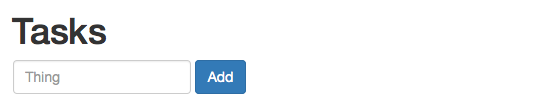

# Tutorial

We'll create a super simple offline-first, remotely synchronized todo list application, step-by-step. End result will look like this:


The final demo code is [available](https://github.com/Kinto/kinto.js/tree/master/demo) in the Kinto.js repository.

> #### Notes
>
> **For this tutorial we'll be using a public test server instance of [Kinto](http://kinto.readthedocs.org/); data stored on this instance are purged every 24 hours. Don't rely on this server for production use.**
>
> If you plan on using your own version of Kinto, please refer to the [setup instructions](http://kinto.readthedocs.org/en/stable/installation.html).

## Bootstrapping a demo Web application

First, let's create a simple HTML file for our demo app, in an `index.html` file:

```html
<!DOCTYPE html>
<html>
<head>
  <meta charset="utf-8">
  <title>Kinto.js demo</title>
  <link rel="stylesheet" href="https://maxcdn.bootstrapcdn.com/bootstrap/3.3.5/css/bootstrap.min.css">
</head>
<body>
  <div class="container">
    <h1>Tasks</h1>
    <form class="form-inline" id="form">
      <div class="form-group">
        <input class="form-control" type="text" name="title" placeholder="Thing">
        <input class="btn btn-primary" type="submit" value="Add">
      </div>
    </form>
    <hr>
    <ul id="tasks" class="list-group"></ul>
  </div>
  <script src="//npmcdn.com/kinto@1.1.2/dist/kinto-1.1.2.js"></script>
  <script src="demo.js"></script>
</body>
</html>
```

For now, our `demo.js` file content is simply:

```js
function main() {
  var db = new Kinto();
  var tasks = db.collection("tasks");
}

window.addEventListener("DOMContentLoaded", main);
```

And that's it. You should see something like this on `http://localhost:3000`:



## Adding new tasks

We want to listen to form submission events to add tasks into our local database. In `demo.js`, we write:

```js
function main() {
  var db = new Kinto();
  var tasks = db.collection("tasks");

  document.getElementById("form")
    .addEventListener("submit", function(event) {
      event.preventDefault();
      tasks.create({
        title: event.target.title.value,
        done: false
      })
      .then(function(res) {
        event.target.title.value = "";
        event.target.title.focus();
      })
      .catch(function(err) {
        console.error(err);
      });
    });
}

window.addEventListener("DOMContentLoaded", main);
```

Notice the call to `tasks.create()`, which returns a [Promise](https://developer.mozilla.org/fr/docs/Web/JavaScript/Reference/Objets_globaux/Promise).

If you try to add a task… well, nothing seems to happen. That's pretty much expected, as we're not displaying anything yet!

Though if you're using Firefox, open your [Developer Tools](https://developer.mozilla.org/en-US/docs/Tools) and head to the *Storage* tab; you should see some IndexedDB databases listed there, and should find you're recently created tasks. If the storage tab is missing, you need to enable "Storage" in the "Toolbox options" menu".:


You should now see a storage tab listing your added entries:


## Listing tasks

All that is great, though we badly want to render our list of tasks now. Let's do that by adding a few lines in our `demo.js` file:

```js
function main() {
  var db = new Kinto();
  var tasks = db.collection("tasks");

  document.getElementById("form")
    .addEventListener("submit", function(event) {
      event.preventDefault();
      tasks.create({
        title: event.target.title.value,
        done: false
      })
      .then(function(res) {
        event.target.title.value = "";
        event.target.title.focus();
      })
	    // Render the list once a value had been submitted.
      .then(render)
      .catch(function(err) {
        console.error(err);
      });
    });

  function renderTask(task) {
    var li = document.createElement("li");
    li.classList.add("list-group-item");
    li.innerHTML = task.title;
    return li;
  }

  function renderTasks(tasks) {
    var ul = document.getElementById("tasks");
    ul.innerHTML = "";
    tasks.forEach(function(task) {
      ul.appendChild(renderTask(task));
    });
  }

  function render() {
    tasks.list().then(function(res) {
      renderTasks(res.data);
    })
    .catch(function(err) {
      console.error(err);
    });
  }

  render();
}

window.addEventListener("DOMContentLoaded", main);
```

Nothing fancy, this is mostly plain old DOM manipulation. Though the interesting bits here are:

- We now call `render()` as soon as the creation promise is resolved;
- The call to `tasks.list()` in `render()` which also returns a promise.

You should now see your added tasks:


Now, refresh the page; your data are still there, thank you [indexedDB](https://developer.mozilla.org/fr/docs/IndexedDB)!

Last, switch off your Internet connection, and try adding tasks. It still works, because we're offline first, remember. We'll get through synchronization a bit later.

> #### Notes
>
> - The Kinto.js API heavily relies on [Promises](https://developer.mozilla.org/en-US/docs/Mozilla/JavaScript_code_modules/Promise.jsm/Promise). Don't hesitate to [learn a bit more](http://pouchdb.com/2015/05/18/we-have-a-problem-with-promises.html) about them before digging further into this tutorial.


## Updating a task

Hey, is this a todo list or what? Where are my checkboxes? Okay, let's implement that.

First, let's move to using a `template` tag in our HTML document so we can define how a task looks like; Add this in your `index.html` file:

```html
  …
  <ul id="tasks" class="list-group"></ul>
  <template id="task-tpl">
    <li class="list-group-item">
      <label>
        <input class="done" type="checkbox">
        <span class="title"></span>
      </label>
    </li>
  </template>
  …
```

Our `renderTask()` function becomes:

```js
  function renderTask(task) {
    var tpl = document.getElementById("task-tpl");
    var li = tpl.content.cloneNode(true);
    li.querySelector(".title").textContent = task.title;
    li.querySelector(".done").checked = task.done;
    return li;
  }
```

You should get this:


But that's not enough. We need to listen to clicks made on the checkbox, so we can actually update the task status:

```js
  function renderTask(task) {
    var tpl = document.getElementById("task-tpl");
    var li = tpl.content.cloneNode(true);
    li.querySelector(".title").textContent = task.title;
    // retrieve a reference to the checkbox element
    var checkbox = li.querySelector(".done");
    // initialize it with task status
    checkbox.checked = task.done;
    // listen to clicks
    checkbox.addEventListener("click", function(event) {
      // prevent the click to actually toggle the checkbox
      event.preventDefault();
      // invert the task status
      task.done = !task.done;
      // update task status
      tasks.update(task)
      // on success, re-render to actually reflect the checkbox states.
      .then(render)
      .catch(function(err) {
        console.error(err);
      });
    });
    return li;
  }
```

Yeah, that's a bunch of lines. I've added comments so you can figure out what's happening. But how powerful is this? Check/uncheck a bunch of tasks; refresh. Close Internet connection. Repeat. Feelings.

> #### Notes
>
> It's important to `catch()` promise rejection, so you are notified when something fails along the asynchonous chain; especially knowing that some browsers will silently ignore rejections.

## Deleting tasks

How about a button to clear all completed tasks? I know you waited for it.

First, let's add the button to the HTML document:

```html
…
<ul id="tasks" class="list-group"></ul>
<button id="clearCompleted" class="btn">Clear completed</button>
…
```

Then the JavaScript:

```js
  document.getElementById("clearCompleted")
    .addEventListener("click", function(event) {
      event.preventDefault();
      tasks.list()
        .then(function(res) {
          // Filter tasks according to their done status
          var completed = res.data.filter(function(task) {
            return task.done;
          });
          // Delete all completed tasks
          return Promise.all(completed.map(function(task) {
            return tasks.delete(task.id);
          }));
        })
        .then(render)
        .catch(function(err) {
          console.error(err);
        });
    });
```

## Synchronizing tasks

Synchronizing local data is done by calling the [`#sync()`](https://doc.esdoc.org/github.com/Kinto/kinto.js/class/src/collection.js~Collection.html#instance-method-sync) method on our collection.

Data synchronization is performed over HTTP and requires a Kinto server; now's probably a good time to tell you about the public mozilla-hosted Kinto server available at `https://kinto.dev.mozaws.net/v1` we'll use for this tutorial:

- **The test server is flushed everyday at 7PM UTC;**
- You'll need to serve the web page over HTTP so Kinto.js can talk to the server. To do so, you can use node's [http-server](https://github.com/indexzero/http-server), Python's [SimpleHTTPServer](https://docs.python.org/2/library/simplehttpserver.html) or whatever Web server you like.

For example, if you're using http-server:

```
$ pwd
/home/niko/kinto.js-tutorial
$ npm install -g http-server
$ http-server /home/niko/kinto.js-tutorial
```

Now back to our web page: let's add a shiny *Synchronize* button and a textarea to display synchronization results:

```html
<div class="row">
  <div class="col-md-6">
    <ul id="tasks" class="list-group"></ul>
    <button id="clearCompleted" class="btn">Clear completed</button>
    <button id="sync" class="btn">Synchronize</button>
  </div>
  <div class="col-md-6">
    <textarea id="results" class="form-control col-md-6" rows="10"></textarea>
  </div>
</div>
```

Then, update the JavaScript:

```js
var syncOptions = {
  remote: "https://kinto.dev.mozaws.net/v1",
  headers: {Authorization: "Basic " + btoa("user:pass")}
};

document.getElementById("sync")
  .addEventListener("click", function(event) {
    event.preventDefault();
    tasks.sync(syncOptions)
      .then(function(res) {
        document.getElementById("results").value = JSON.stringify(res, null, 2);
      })
      .then(render)
      .catch(function(err) {
        console.error(err);
      });
  });
```

Now, if you click on the button, you should see the JSON synchronization result object in the textarea:


Here's a sample result object:

```json
{
  "ok": true,
  "lastModified": 1434617181458,
  "errors": [],
  "created": [],
  "updated": [],
  "deleted": [],
  "published": [
    {
      "last_modified": 1434617181453,
      "done": false,
      "id": "0422fba7-32ad-48e2-a9eb-82725b12e6fa",
      "title": "eat cheese",
      "_status": "synced"
    },
    {
      "last_modified": 1434617181458,
      "done": false,
      "id": "7ca54d89-479a-4201-8494-ba7d40b9248f",
      "title": "eat more cheese",
      "_status": "synced"
    }
  ],
  "conflicts": [],
  "skipped": []
}
```

Let's review the different result object properties:

- `ok`: this is set to `false` when any error or conflict has been encountered;
- `lastModified`: the collection latest modification timestamp;
- `errors`: the list of encountered errors (eg. IndexedDB errors), if any;
- `created`: the list of records imported locally;
- `updated`: the list of records updated locally;
- `deleted`: the list of records deleted locally;
- `published`: the list of records published; here we see we successfully pushed our two local tasks;
- `conflicts`: the list of conflicts encountered, if any (we'll see this in a minute);
- `skipped`: the list of skipped operations; for example, if we're trying to remotely delete a record which doesn't exist on the server, that information will be listed here.

## Handling conflicts

If the client and the server have different versions of a single record, it will be listed in the `conflicts` sync result property.

Let's create a conflict by:

- Marking a local task record as `done`;
- Updating the record on the server and alter its title; we'll use [httpie](https://github.com/jakubroztocil/httpie) to do so:

To do that, we are using [HTTPie](https://github.com/jakubroztocil/httpie), an easy to use CLI http client.

```
$ http -a user:pass PATCH https://kinto.dev.mozaws.net/v1/collections/tasks/records/c8d522b1-11bd-4c0a-ab34-a36c427e0530 title="eat even more cheese"
Access-Control-Expose-Headers: Backoff, Retry-After, Alert
Content-Length: 118
Content-Type: application/json; charset=UTF-8
Date: Thu, 18 Jun 2015 09:01:00 GMT
Server: waitress

{
    "done": false,
    "id": "c8d522b1-11bd-4c0a-ab34-a36c427e0530",
    "title": "eat even more cheese",
    "last_modified": 1434619745465
}
```

If we try to [`#sync`](https://doc.esdoc.org/github.com/Kinto/kinto.js/class/src/collection.js~Collection.html#instance-method-sync), now we get a conflict:

```js
{
  "ok": false,
  "lastModified": 1434619745465,
  "errors": [],
  "created": [],
  "updated": [],
  "deleted": [],
  "published": [],
  "conflicts": [
    {
      "type": "incoming",
      "local": {
        "last_modified": 1434619634577,
        "done": true,
        "id": "c8d522b1-11bd-4c0a-ab34-a36c427e0530",
        "title": "eat even more cheese",
        "_status": "updated"
      },
      "remote": {
        "last_modified": 1434619745465,
        "done": false,
        "id": "c8d522b1-11bd-4c0a-ab34-a36c427e0530",
        "title": "eat even more cheese!"
      }
    }
  ],
  "skipped": []
}
```

The conflict entry is rather self-explanatory, though let's dig into the details:

- `type`: The conflict direction, either `incoming` or `outgoing`; here the conflict occured when trying to import the change from the server;
- `local`: The local record version;
- `remote`: The server record version.

Now it's up to you how you want to resolve the conflict; for example, you could:

- override the local version with the remote one;
- compare the `last_modified` values and decide what to do accordingly;
- pick the right fields from both versions;
- etc.

Your take really. Let's take the former approach:

```js
  function handleConflicts(conflicts) {
    return Promise.all(conflicts.map(function(conflict) {
      return tasks.resolve(conflict, conflict.remote);
    }))
      .then(function() {
        tasks.sync(syncOptions);
      });
  }

  document.getElementById("sync")
    .addEventListener("click", function(event) {
      event.preventDefault();
      tasks.sync(syncOptions)
        .then(function(res) {
          document.getElementById("results").value = JSON.stringify(res, null, 2);
          if (res.conflicts.length) {
            return handleConflicts(res.conflicts);
          }
          return res;
        })
        .then(render)
        .catch(function(err) {
          console.error(err);
        });
    });
```

We're using [`#resolve()`](https://doc.esdoc.org/github.com/Kinto/kinto.js/class/src/collection.js~Collection.html#instance-method-resolve) to mark a conflict as resolved: it accepts a conflict object, and a resolution one; the latter is what will be updated locally and sent for resynchronization on a next call to [`#sync()`](https://doc.esdoc.org/github.com/Kinto/kinto.js/class/src/collection.js~Collection.html#instance-method-sync) — which is exactly what we're doing after we've resolved all our conflicts.

## Now what?

That's all folks. Now feel free to browse the [API documentation](api.md), report [an issue](https://github.com/Kinto/kinto.js/issues/new), learn how to [contribute](hacking.md), but most of all: have fun.
